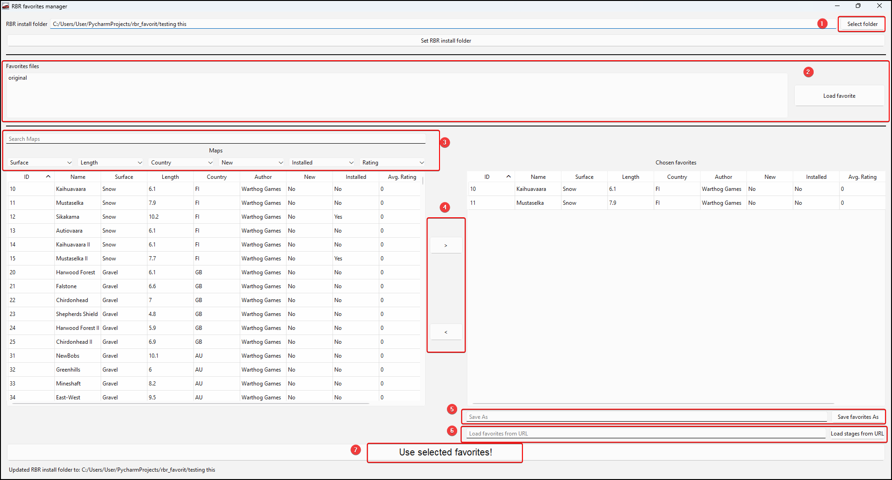

# Info
This program will help managing the favorites for the Richard Burns rally game and using the rsf plugin.

This program shows the data regarding all stages and allows the creation of custom favorites listings.

It uses rsf's favorites handling methodology and replaces the currents favorites file with the one selected in the application.

It's primary goal was to allow checking an online rally stages from the RSF's website, and, using the application, create a new favorites file with all the stages from the online rally, this would allow the players to see all the stages in the "Favorites" category of the "Practice" mode.

# Installation
Download the zip from the releases and extract it. The executable will be available on the extracted folder.

## Compilation
If you would rather compile it yourself, you can use **pyinstaller** to do so:
```
pyinstaller -w -n rbr_favorites_manager gui.py
```
# How to use
This is the program's main window:


1. Start by selecting the RBR install folder, if needed press the "Set RBR Install folder" button
2. This will display all created favorites listing so far, they are saved as "favorite_[name]" in the **[RBRINSTALLDIR]/rsfdata/cache/** folder
3. Search for maps using any column to filter
4. Use the button to include or exclude maps to the current selected favorites
5. Save the current favorites with a name
6. Set the current favorites as the ones to use in RBR. You **MUST** press this to view the favorites in RBR.